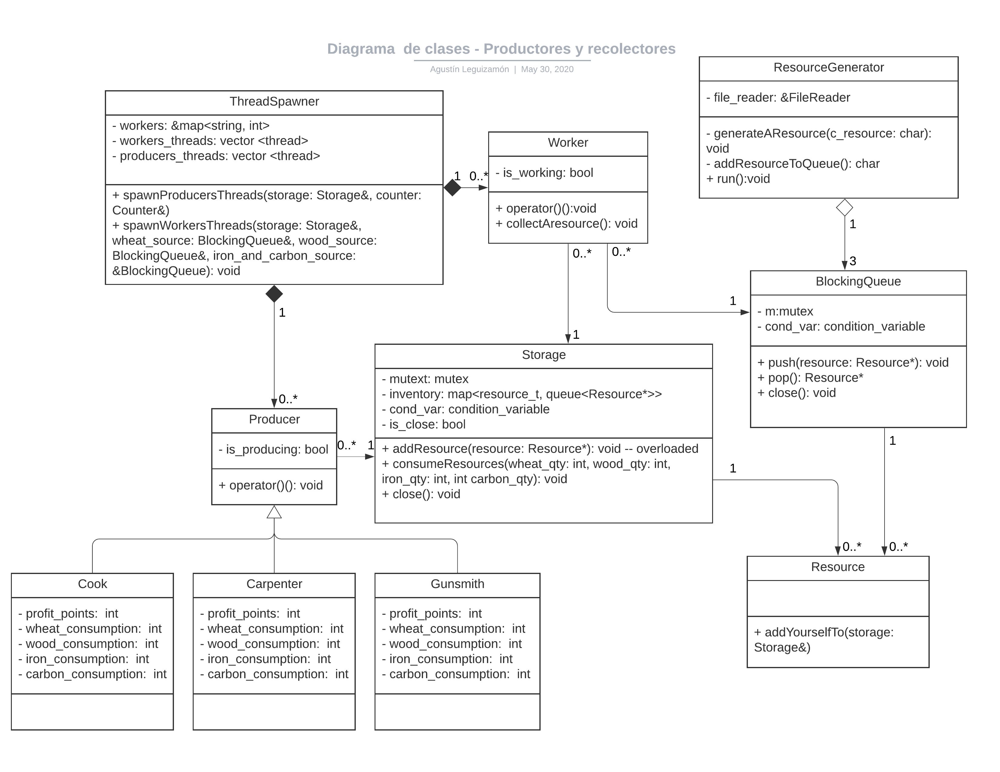

# Trabajo práctico Nro 2
## Productores y recolectores

Estudiante: Agustin Manuel Leguizamón

Padrón: 99535

Link Github: https://github.com/AgustinLeguizamon/tp2

Instancia de entrega: 1

### Introducción:
En el siguiente diagrama de clases se resaltan las relaciones entre las clases mas relevantes en cuanto a la implementación.


Figura 1 - Diagrama de clases

### Solución planteada:

Siguiendo las consignas de la cátedra se cada recolector y productor es un hilo a parte del hilo principal encargado de realizar la tarea asignada, a continuación se dará una explicación de como se ha encarado el funcionamiento de cada clase.

El hilo main es encargado de leer ambos archivos trabajadores.cfg y mapa.txt y de "spawnear" los hilos de trabajadores y recolectores. Ambos estarán operando desde el momento en que son creados obteniendo los recursos a partir de colas bloqueantes (recolectores) y un inventario (productores).
La sincronización entre ambos grupos de hilos (recolectores y productores) se logra con el manejo de mutex y condition variables para el acceso en orden al inventario dado que ambos estarán agregando y sacando recursos de forma concurrente.

La explicación de cada clase se da en el orden en que son creadas para dar una idea al lector de en qué momento empiezan a operar los hilos.

####File Reader
Encargado de leer ambos archivos, primero lee el archivo de texto trabajadores.cfg para obtener el número de productores y recolectores (hilos) que estarán operando.
El nombre del productor junto con su número son guardados en un diccionario.
Luego cierra este archivo y pasa a leer el mapa de los recursos (mapa.txt) de a un carácter y almacenarlos en una lista.

**En este caso se está trabajando con todo el contenido del mapa en memoria**

#### Blocking Queue
Encargados de almacenar los recursos asignados, la clase **Resource Generator** 
se encargará de colocar los recursos en la cola y esta será accedidos por los recolectores que los quitaran.
Para evitar problemas de acceso se utiliza un **mutex** para cada operación (push, pop) además se tiene una **condition variable** encargada de detener a los hilos que quieran obtener un recurso cuando está vacía pero todavía faltan que se le agreguen recursos. En cuanto ocurre un push, se le notificará a todos los hilos que hay un nuevo recurso disponible en la cola. Caso contrario (cuando está vacía y no hay más recursos) se lanzará una excepción que será atrapada por el recolector (**Worker**).

#### Storage (inventario)
Este recurso compartido tanto por los **Workers** como por los **Producers** se encarga de almacenar los recursos extraídos de las **Blocking Queue** y colocados por los recolectores y de sacarlos para su uso por los productores.
De una manera similar a la cola bloqueante, el acceso al inventario está controlado por un **mutex**, en el caso de agregar un recurso simplemente se hace un lock y se agrega al inventario para luego notificar a los hilos. El acceso para retirar recursos tiene además una **condition variable** de manera que si todavía no hay recursos suficientes se suspende la ejecución del hilo.

**La condition variable despierta los hilos de productores al momento de que recibe un recurso independientemente si se ha alcanzado la cantidad mínima para un receta, si resulta que la condición no se cumple los hilos volverán a ser suspendidos**

Para el consumo de recursos se utiliza una sola función `consumeResources` que recibe por parámetro la cantidad de recursos a quitar del inventario, esta función es utilizada por todos los **Producers**

#### Counter (contador puntos de beneficio)

Posee un contador (sumador) que recibe por parámetro la cantidad de puntos de beneficio a sumar, esta cantidad varía según el productor. Se utiliza un mutex para evitar un race condition sobre el contador.

#### Printer
Encargado de imprimir los resultados con la cantidad de recursos restantes en el inventario y puntos de beneficio acumulados.

#### Thread Spawner
Esta clase está encargada de crear las clases **Worker** y **Producers** y lanzar los respectivos hilos. También se encarga de la liberación de los recursos (join) de cada thread.

#### Producer (productor)

Cada productor se ejecuta en un hilo, el productor intentará solicitar al inventario que consuma los recursos necesarios para su receta, caso que se cumpla depositara en el contador **Counter** los puntos de beneficio. Las cantidades de recurso a consumir y los puntos de beneficio generados depende de cada tipo de productor.

*En la resolución del trabajo práctico he tomado la decisión de crear clases derivadas para cada productor pensando que esto sería conveniente dado que cada uno produce con cantidades distintas de recursos, pero al final se terminó delegando esta tarea al Storage(inventario) pasando por parámetro, en forma de receta, los recursos necesarios. Esto provoca que todos los productores usen un único operador() que es el Base y la única diferencia sean los atributos que tienen por lo que hace excesivo el hecho de usar herencia, se podría simplemente tener la clase Producer y pasar por parámetro al constructor los atributos que son las cantidades de recursos que se consumen, siguiendo la misma idea que con los recolectores (Workers)*

#### Worker (Recolector)
A pesar de existir distintos tipos de recolectores (leñadores, agricultores, mineros) todos son instancias de una única clase **Worker** ya que la única diferencia que tiene es el tipo de cola bloqueante que tienen asignada para extraer los recursos. Mientras estén operando, intentan quitar recursos de sus respectivas colas bloqueantes y colocarlos en el inventario del **Storage**, así hasta que la cola asignada lanza una excepción que indica que están vacías y no recibirán más recursos. En este momento terminará así la ejecución del operador() y dejará al hilo listo para un *join*.

**Cada recolector es un hilo que intentara acceder a la cola y al inventario de forma concurrente, el manejo de estos accesos está explicado en cada clase**


#### Resource Generator
Encargado de recorrer la lista con los recursos generada por **File Reader** y crear (con un New) él **Resource** correspondiente al caracter para pushear a aquella cola bloqueante asignada para ese tipo de recurso. Luego cuando la lista de recursos se vacía, cierra cada cola bloqueante de manera de indicar a cada uno que no recibirá más recursos desde ese punto en adelante.


#### Resource

Cada recurso es un instancia de la clase derivada de **Resource** que empieza en cada una de las colas bloqueantes y termina en el **Storage**. Cada objeto es alojado en memoria dinámica para evitar el object slicing al ser almacenados en las colas bloqueantes que almacenan punteros a **Resource**. La adición de estos recursos al inventario consta de un DoubleDispatch en donde la función `addYourselfTo` recibe por parámetro el **Storage** y llama a la función `addResource` del mismo pasándose a sí mismo como parámetro. Como cada objeto es de un tipo distinto la función se puede sobrecargar de la siguiente manera.

```
void Storage::addResource(Wheat* wheat)
void Storage::addResource(Wood* wood)
void Storage::addResource(Iron* iron)
void Storage::addResource(Carbon* carbon)
```

*Nuevamente al principio del trabajo se consideró útil el que cada recurso sea una clase distinta derivada de Resource y para el cual se pudo implementar DoubleDispatch, aunque parece algo excesivo dado que podría tratar directamente como una instancia de Resource y así evitar la herencia pero debería verse el tema de cómo agregar cada recurso al inventario y la identificación de critical section y que este sea atómico*


